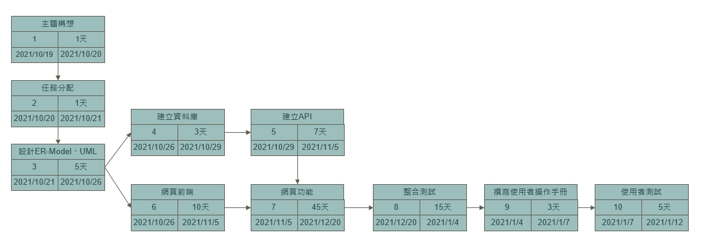
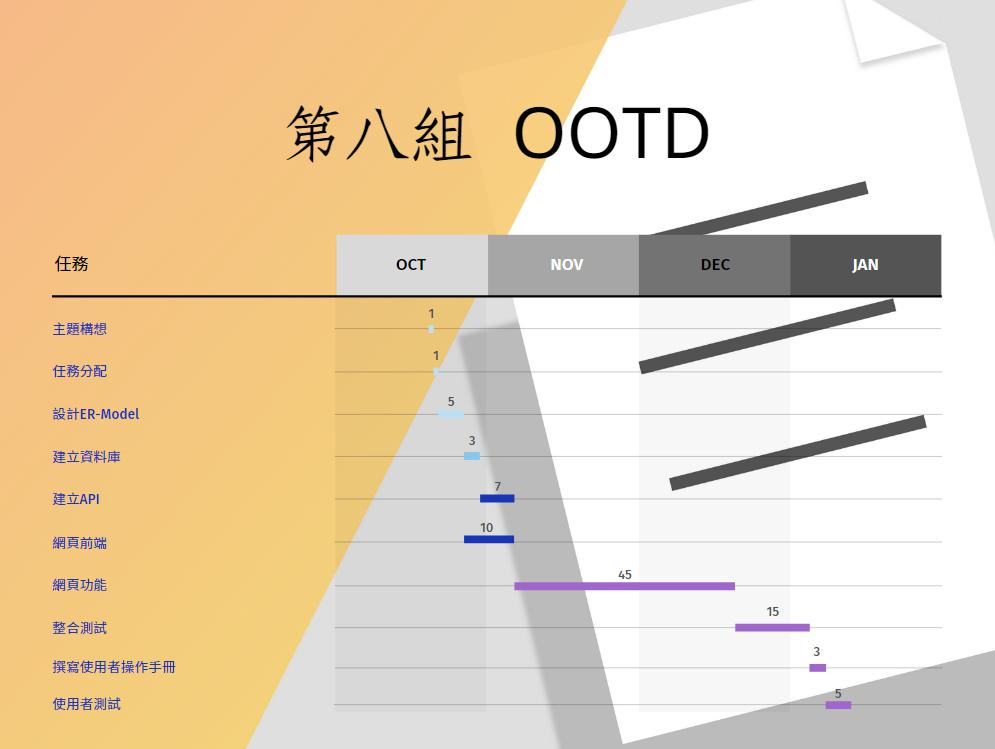
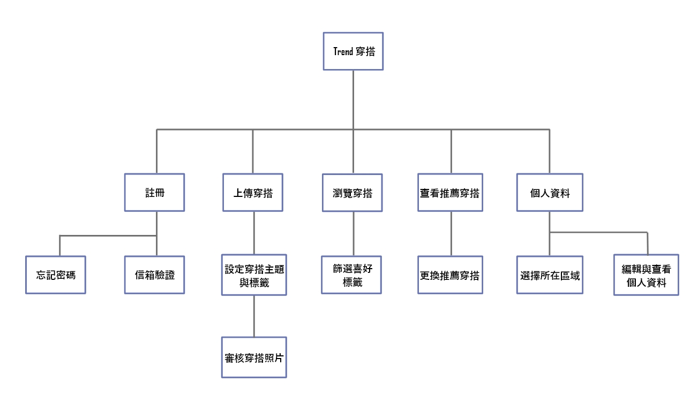
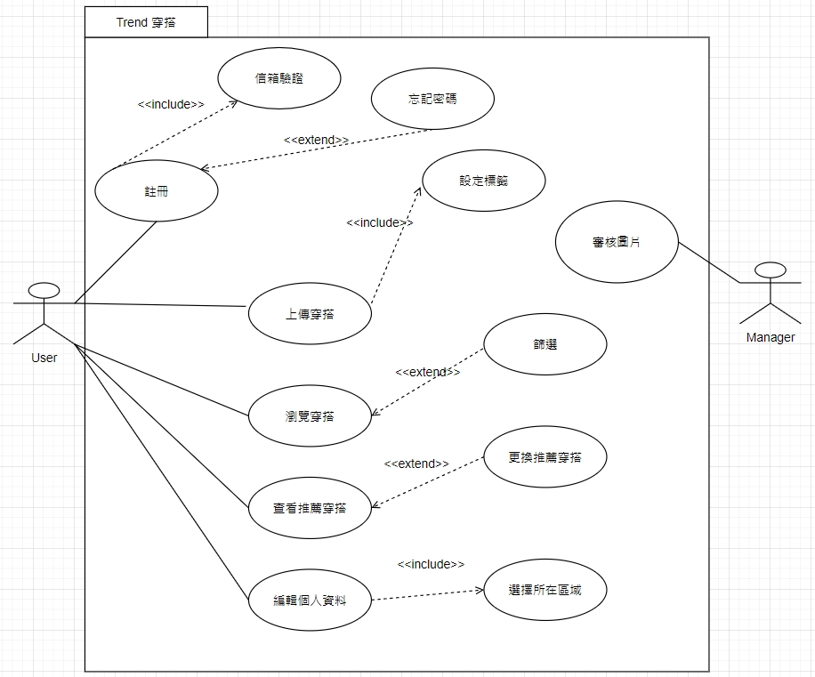
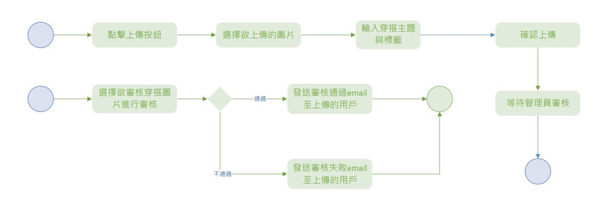
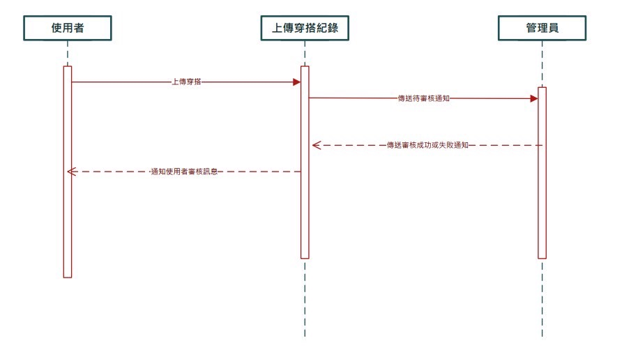
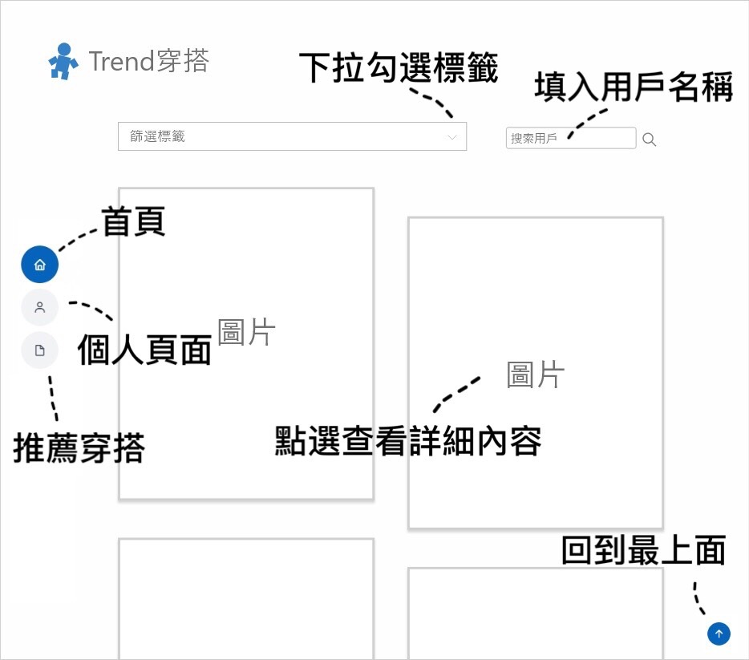
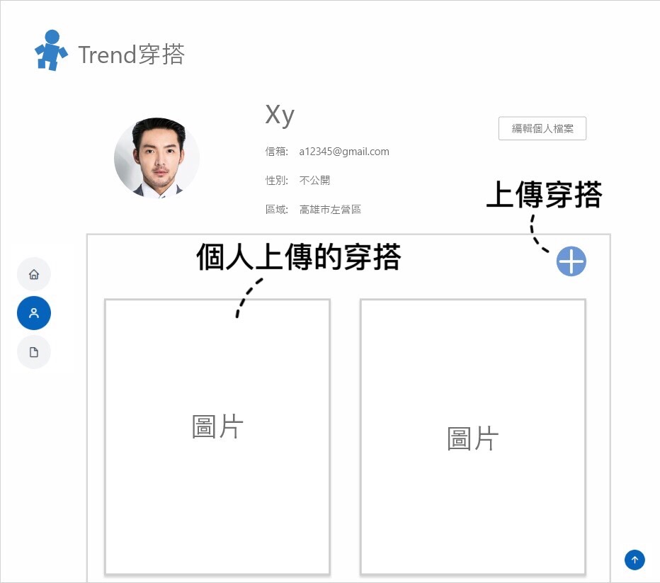
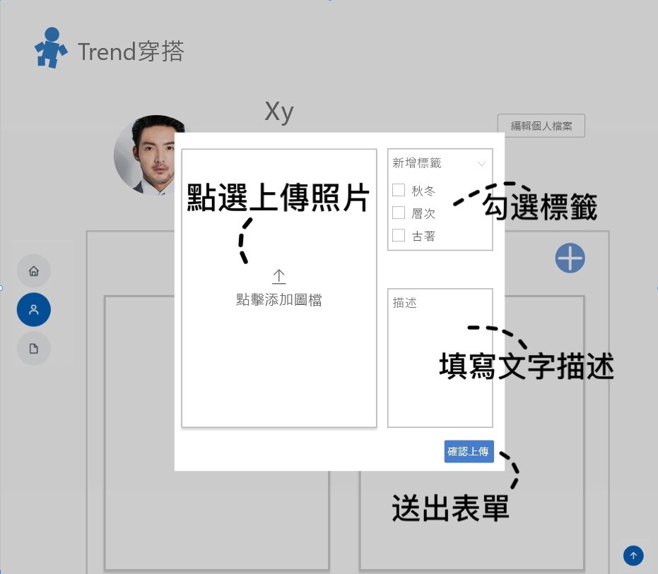
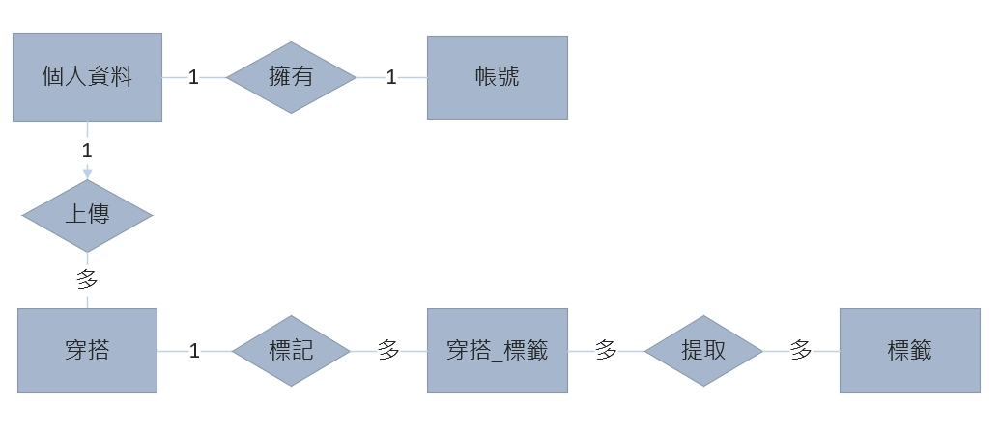

# System-analysis

>## 第08組
>>  學號       |  姓名   
>> ------------|:-----
>> c108118242  | 范燁庭(組長)
>> c108118215  | 林孟樺
>> c108118217  | 陳念歆
>> c108118221  | 曾郁芳
>> c108118228  | 邱瑩奉

# 題目:Trend穿搭
># 內容:
>>## 隨著生活型態的變化，如今穿搭的多樣化使它已成為人們生活中不可或缺的一部分，不論衣櫃的衣服多寡，為了應對天氣變化、迷信與場合等，每日穿搭時常成為我們生活中的困擾，為解決以上問題，欲開發一網站提供上傳服飾資料、並根據天氣或其他要求等提供穿搭建議。
------------------------------------------

# PERT/CPM
## 
# 關鍵路徑:  1->2->3->6->7->8->9->10

------------------------------------------
# 甘特圖
##  

------------------------------------------

># 功能性需求    
>>####  1. 上傳穿搭：使用者上傳自己的穿搭，以供他人觀看。
>>####  2. 瀏覽穿搭：使用者可以查看其他使用者上傳的穿搭照片，也可根據自己的喜好進行穿搭篩選。
>>####  3. 查看推薦穿搭：系統會根據每天的溫度變化推薦不同的穿搭給使用者，使用者若不喜歡也可使用change的功能，讓系統重新推薦穿搭。

># 非功能性需求
>>####  1.反應時間 ：使用者變更推薦穿搭時，系統可以快速推薦一套新的穿搭給使用者。
>>####  2.效能：使用者瀏覽穿搭時，系統可以快速提供所有穿搭以供查看。
>>####  3.可靠度：讓使用者可以順利上傳自己的穿搭。
------------------------------------------
># FDD
>>## 

>## 需求分析簡述如下：
>>#### 1.使用者可以藉由上傳照片分享自己的穿搭，並透過管理者審核。
>>#### 2.使用者透過篩選來瀏覽自己的喜好穿搭。
>>#### 3.使用者藉由設定所在區域來查看推薦的穿搭。
 
--------------------------------------------
># UCD
>>## 
># 使用案例說明
>>  使用案例名稱    |     上傳穿搭
>> ------------|:-----
>> 行動者       |:用戶
>> 說明         |:用戶上傳自己的穿搭供他人查看
>> 完成動作     | 1.上傳穿搭照片 2.輸入穿搭主題名稱  3.新增主題標籤
>> 替代方法     |  無
>> 先決條件     | 用戶至少上傳一張圖片
>> 後置條件     | 後台管理員進行圖片審核
>> 假設         | 無

>>  使用案例名稱    |     篩選
>> ------------|:-----
>> 行動者       | 用戶
>> 說明         | 根據喜好標籤進行篩選
>> 完成動作     | 1.選擇喜好的標籤 2.系統根據所選標籤顯示符合條件之穿搭
>> 替代方法     | 無
>> 先決條件     | 至少一位用戶上傳穿搭圖片
>> 後置條件     | 無
>> 假設         | 篩選結果不滿意可以重新選擇喜好的標籤

>>  使用案例名稱    |     查看推薦穿搭
>> ------------|:-----
>> 行動者       | 用戶
>> 說明         | 用戶根據所在區域查看今日推薦穿搭
>> 完成動作     | 用戶點選今日推薦穿搭並查看
>> 替代方法     | 無
>> 先決條件     | 至少一位用戶上傳穿搭圖片
>> 後置條件     | 無
>> 假設         | 對於推薦不滿意可更換推薦
----------------------------------------------------------------------
# DFD
## 

# DFD圖0
## 

# UML類別圖
## 

# 活動圖
## 

# 循序圖
## 
------------------------------------------------------------------------
# 分鏡板
## 首頁
### 

## 個人頁面
### 

## 上傳穿搭頁面
### 

## 編輯個人資料頁面
### 

-----------------------------------------------------------------
# 實體關係圖
## 
