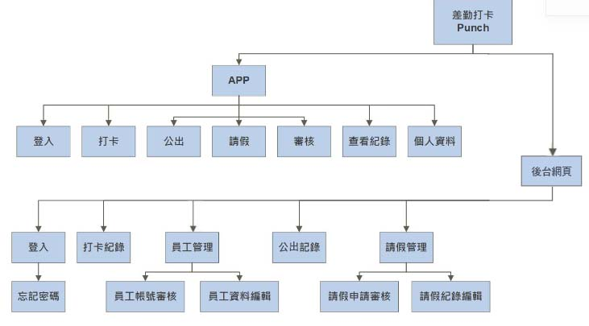
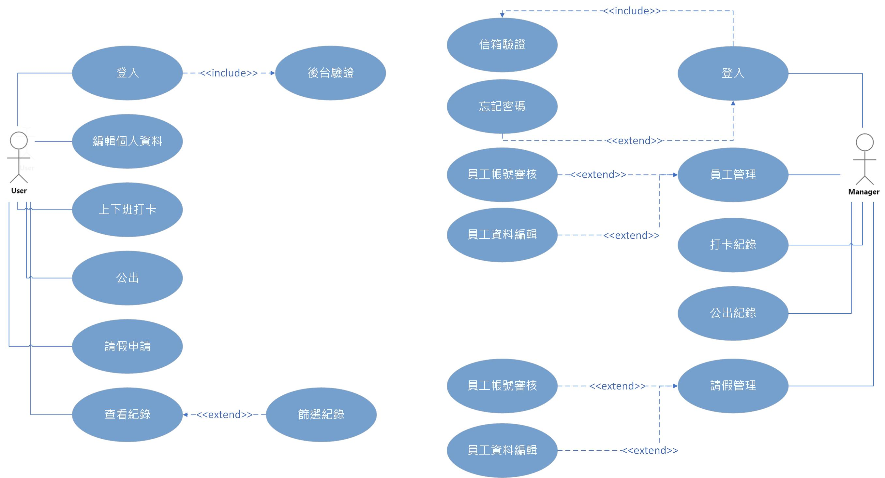

# System-analysis

>## 第08組
>>  學號       |  姓名   
>> ------------|:-----
>> c108118242  | 范燁庭(組長)
>> c108118215  | 林孟樺
>> c108118217  | 陳念歆
>> c108118221  | 曾郁芳
>> c108118228  | 邱瑩奉

# 題目:差勤打卡
># 內容:
>>## 大部分的工作場所都有打卡的需求，而使用舊式打卡鐘利用紙本打卡不但不環保，想統計人員出勤資料也很麻煩，打卡地點也無法彈性修改。在科技進步的時代，幾乎人手都有一隻智慧型手機，使用差勤打卡只要填寫基本資料供後台審核，審核通過後，開啟GPS定位，就能一鍵輕鬆上下班。有別於現有打卡APP，也提供了公出功能，方便需要外勤的人員可以隨時記錄時間與地點，也提供了請假功能，只要使用手機就能提出休假申請。每位人員都能在APP上檢視自己的打卡、請假、公出的紀錄，而管理人員也可在後台看員工的出勤狀況與審核員工提出的申請。
------------------------------------------

# PERT/CPM
## 
# 關鍵路徑:  1->2->3->6->7->8->9->10

------------------------------------------
# 甘特圖
##  

------------------------------------------

># 功能性需求    
>>####  1. 上下班打卡：使用者於指定時間內及公司設定地址範圍內即可使用上下班打卡。
>>####  2. 編輯個人資料：使用者可以查看自己的部門與職稱，也可修改e-mail與電話，在此處也可進行登出。
>>####  3. 公出：有公出開始、到站、公出結束等功能，可記錄使用者的公出地點與時間。
>>####  4. 請假申請：使用者提出請假申請供後台進行審核。
>>####  5. 查看紀錄：使用者可查看上下班打卡、公出、請假紀錄。

># 非功能性需求
>>####  1.反應時間 ：使用者使用上下班打卡時，系統可以快速辨識是否在有效打卡時間和打卡地點。
>>####  2.效能：使用者使用上下班打卡、公出、申請請假時，系統快速將資料傳送至後台。
>>####  3.可靠度：讓使用者可以順利打卡、公出、申請請假。
------------------------------------------
># FDD
>>## 

>## 需求分析簡述如下：
>>#### 1.使用者可以修改自己的個人資料。
>>#### 2.使用者可簡單按下按鈕進行打卡。
>>#### 3.使用者可簡單按下按鈕進行公出。
>>#### 4.使用者可提出請假申請，讓後台管理者審核。
>>#### 5.使用者可查看紀錄，也可篩選出想顯示的紀錄。
 
--------------------------------------------
># UCD
>>## 
># 使用案例說明
>>  使用案例名稱    |     上下班打卡
>> ------------|:-----
>> 行動者       |:用戶
>> 說明         |:用戶於上下班時間進行打卡
>> 完成動作     | 用戶按下上班打卡按鈕或下班打卡按鈕
>> 替代方法     |  無
>> 先決條件     | 用戶要先開啟gps定位並於規定之上下班時間和規定範圍才可打卡
>> 後置條件     | 無
>> 假設         | 無

>>  使用案例名稱    |     公出
>> ------------|:-----
>> 行動者       | 用戶
>> 說明         | 用戶在上班時間外出時可記錄公出地點與時間
>> 完成動作     | 用戶按下公出開始按鈕或到站按鈕或公出結束按鈕
>> 替代方法     | 無
>> 先決條件     | 無
>> 後置條件     | 無
>> 假設         | 無

>>  使用案例名稱    |     請假
>> ------------|:-----
>> 行動者       | 用戶
>> 說明         | 用戶可申請請假
>> 完成動作     | 用戶選擇假別、選擇請假起始與結束日期、輸入原因即可提出申請
>> 替代方法     | 無
>> 先決條件     | 要填寫所有項目才能送出申請
>> 後置條件     | 無
>> 假設         | 無
----------------------------------------------------------------------
# DFD
## 

# DFD圖0
## 

# UML類別圖
## 

# 活動圖
## 
## 
## 

# 循序圖
## 
## 
## 
------------------------------------------------------------------------
# 分鏡板
## 首頁
### 
## 請假申請頁面
### 
## 公出頁面
### 

-----------------------------------------------------------------
# 實體關係圖
## 

# 程式碼github
### https://github.com/C108118206/People_errand
